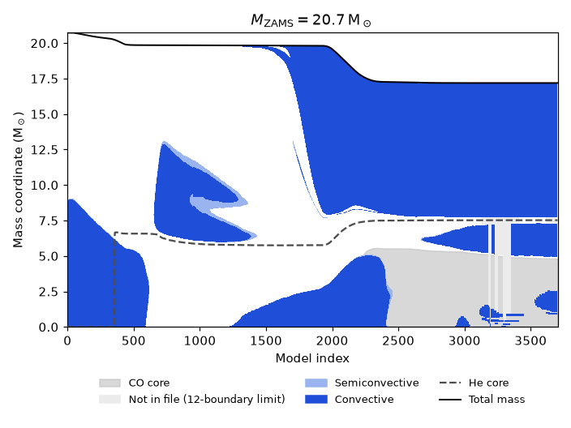
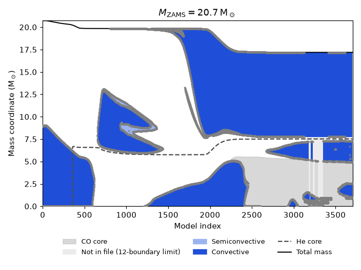
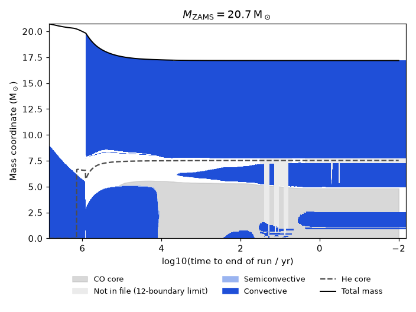

# kipp — shaded Kippenhahn diagrams from STARS `plot` files

Turns the `M_conv1..12` boundary columns of a Cambridge STARS `plot` file into
filled convective / semiconvective regions on a (time × mass) diagram.
No Kaitiaki dependency (numpy + matplotlib only), but it slots into Kaitiaki
easily — see below.



```bash
pip install -e .
python -m kipp plot.STANDARD_SINGLE_DOUBLEPREC -o kipp.png --xaxis collapse
```

## The problem, and why it isn't a shape-recognition problem

Each row of a `plot` file holds up to 12 mass coordinates of convective
boundaries. Plotting column *k* against time gives the familiar cloud of dots,
because column *k* is a **slot**, not a zone: when zones appear, vanish, split
or merge, every boundary shifts columns. Trying to join the dots into polygons
across time is the hard problem everyone hits.

You don't have to. Each row already describes the star's complete layering at
that instant — the file just labels the **boundaries** instead of the
**regions**, and the label is the sign. From the STARS manual (§3.7):

> Semi-convective boundaries are determined by the parameter DR in `data` and
> are reported where 0 < ∇ − ∇_ad < DR. Boundaries between convective and
> semi-convective regions are marked by negative signs. Convective-radiative
> boundaries have no sign.

So there are three region types — radiative, semiconvective, convective — and
because ∇ − ∇_ad is continuous the only transitions are rad ↔ semi ↔ conv.
That makes decoding a row a deterministic walk from the centre outward:

- sort the non-padding entries by |m| (padding is `0.0` or `±M_total`)
- a `+` boundary flips rad ↔ semi, a `−` boundary flips semi ↔ conv
- the start state is whichever of {rad, semi, conv} makes the whole walk
  legal (a `+` can't follow conv, a `−` can't follow rad)

Once every row is a list of `(lo, hi, kind)` intervals, paint them as vertical
strips and the shapes draw themselves. No zone tracking, no polygon fitting.

Two wrinkles the data throws in, both handled:

- **Ties.** STARS prints 5 decimals, so the two sides of a thin
  semiconvective skin often print with identical |m| (`+19.8422, −19.8422`).
  Their order is then unknowable; the decoder tries both. Without this, 8 % of
  rows in the sample file are undecodable; with it, none are.
- **Truncation.** Twelve slots is a hard limit. Late in the evolution the
  star has more boundaries than that and the list is cut off at the outside.
  A truncated row is *not* extended to the surface (that would paint a
  central shell as a 17 M☉ envelope); the convective envelope is restored
  from the `M_conv-env` column (col 71) instead, and whatever else lies above
  the last reported boundary is drawn as a light "not in file" band. In the
  sample run this happens for ~20 models near index 3250, where six tiny
  central shells use every slot and the He-shell zone above them is lost.

## Validation

`--dots` overlays the raw |M_conv| values (the legacy Kaitiaki view). Every
dot should sit on the edge of a shaded region:



`tests/test_integration.py` asserts physics facts about the sample 20.7 M☉
run: ZAMS convective core at 8.96 M☉ shrinking and vanishing at the TAMS, the
intermediate convective zone appearing at ~model 670, the He-burning core
growing inside the He core, and a convective envelope with base 7.5–9.5 M☉
throughout the supergiant phase. All 3704 models decode with zero errors.

## Usage

```bash
python -m kipp PLOTFILE [-o OUT.png] [--xaxis model|index|age|collapse]
                        [--n-mass N] [--no-semiconv] [--dots] [--dpi D]
                        [--dump-intervals OUT.json]
```

`--xaxis collapse` gives the log10(time-to-end-of-run) layout used in the
literature:



`--dump-intervals` writes the decoded layering per model as JSON —
`[{"model": 32210, "intervals": [[0.00064, 8.96118, "conv"], ...]}, ...]` —
which is the "list of shapes" if you want zone lifetimes, masses, etc. without
going through the plot.

From Python:

```python
from kipp import load_plot, decode_all, plot_kippenhahn

data = load_plot("plot.STANDARD_SINGLE_DOUBLEPREC")
intervals, bad_rows = decode_all(data["conv"], data["M"], conv_env=data["conv_env"])
ax = plot_kippenhahn(data, xaxis="collapse", intervals_per_model=intervals)
ax.figure.savefig("kipp.png", dpi=200)
```

### With Kaitiaki

`plot_kippenhahn` only needs a dict of arrays, so a Kaitiaki plot object can
feed it directly:

```python
import numpy as np, kaitiaki
from kipp import plot_kippenhahn

p = kaitiaki.file.plot("plot.STANDARD_SINGLE_DOUBLEPREC")
data = {
    "model":    np.asarray(p.get("timestep"), float),
    "age":      np.asarray(p.get("age"), float),
    "M":        np.asarray(p.get("M"), float),
    "He_core":  np.asarray(p.get("He_core"), float),
    "CO_core":  np.asarray(p.get("CO_core"), float),
    "conv":     np.column_stack([p.get(f"M_conv{k}") for k in range(1, 13)]).astype(float),
    "conv_env": np.asarray(p.get("M_conv-env"), float),
}
plot_kippenhahn(data, xaxis="collapse")
```

(`conv_env` is optional; without it, truncated rows just show the "not in
file" band up to the surface.)

## Layout

```
kipp/io.py         load_plot        read the file; tolerant of the fixed-width
                                    overflow that merges cols 71 and 72
kipp/decode.py     decode_row       one row → [Interval(lo, hi, kind)]
                   decode_all       all rows, envelope restoration, bad-row list
                   unknown_regions  what a truncated row can't tell you
kipp/rasterise.py  rasterise        intervals → boolean (model × mass) masks
kipp/render.py     plot_kippenhahn  masks → matplotlib
kipp/cli.py        main
tests/             111 tests; test_integration.py needs data/plot.*
```

Everything is a pure function; the rendering never calls `plt.show()` except
the CLI without `-o`.
